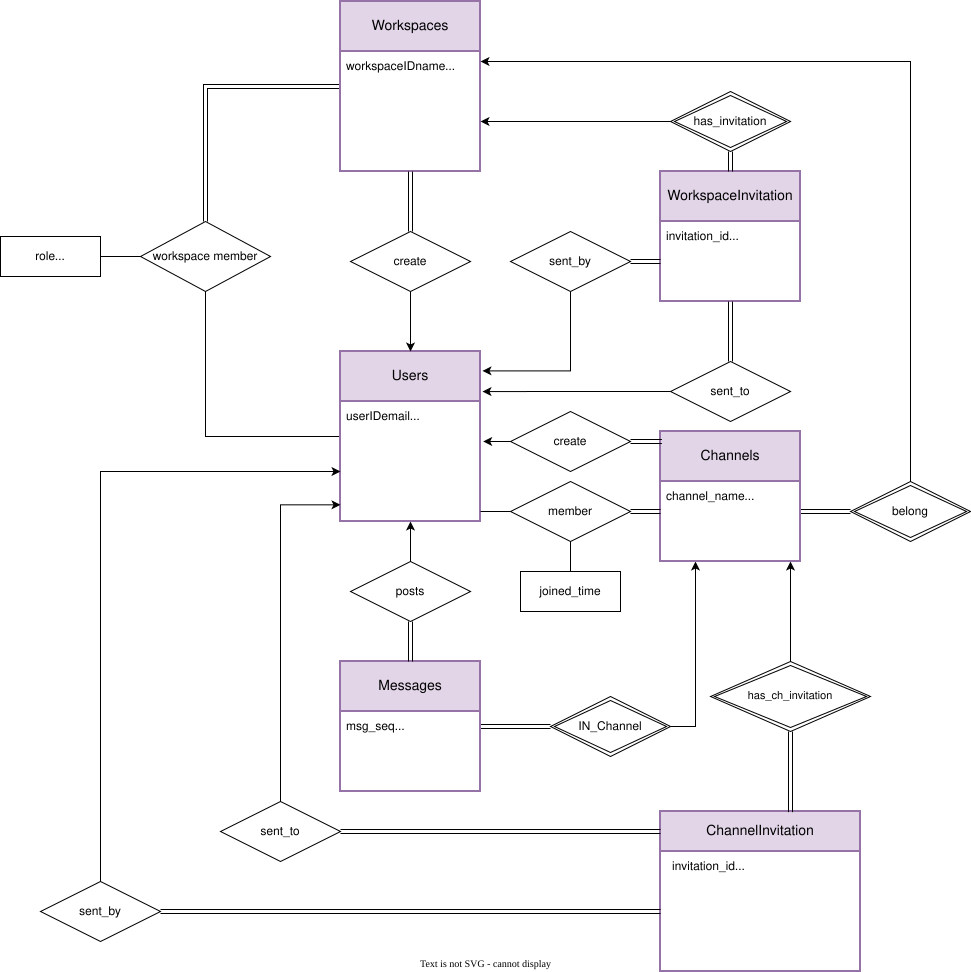
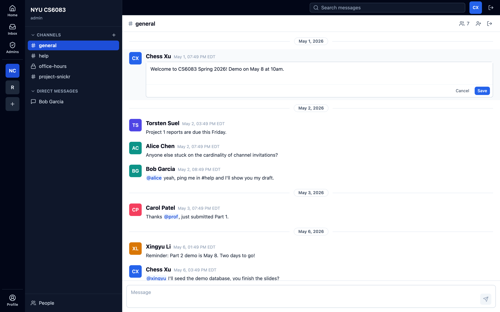
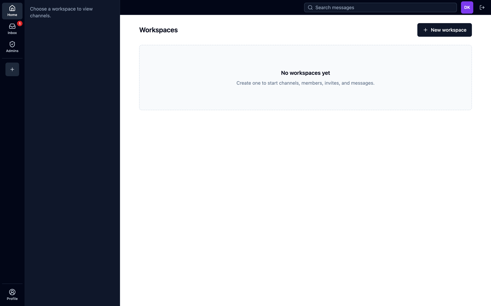
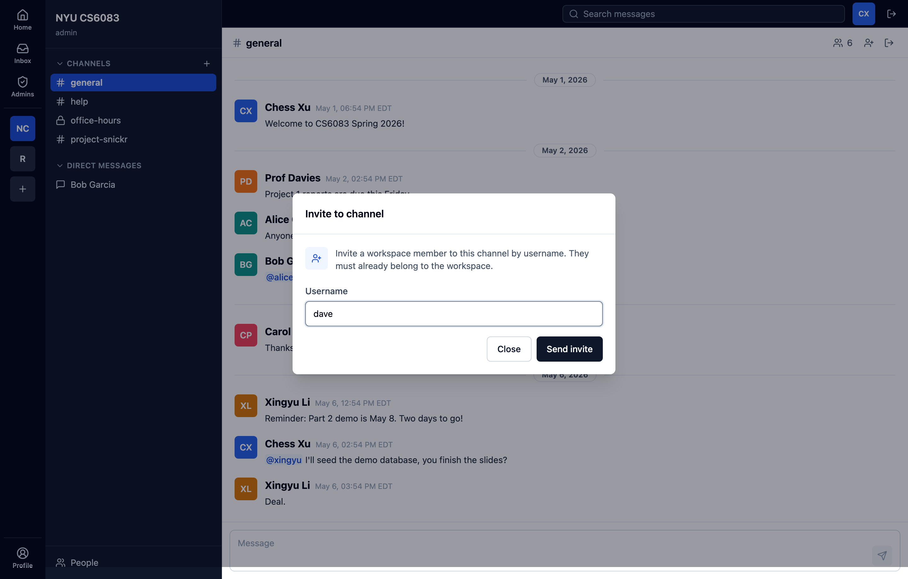
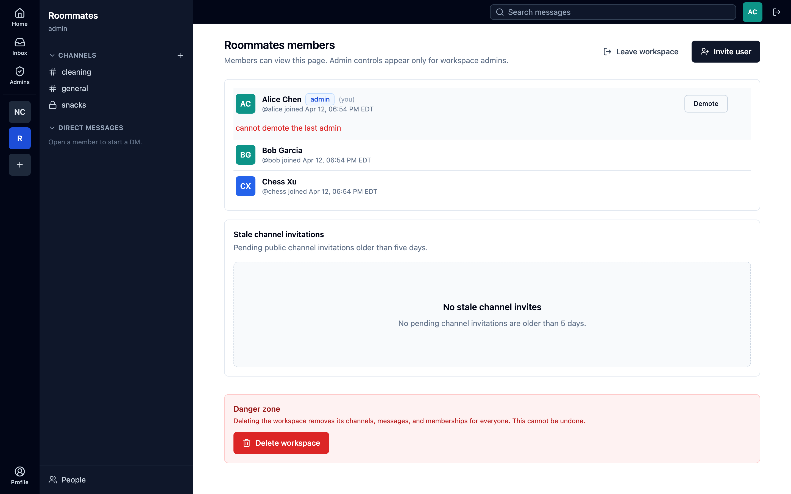
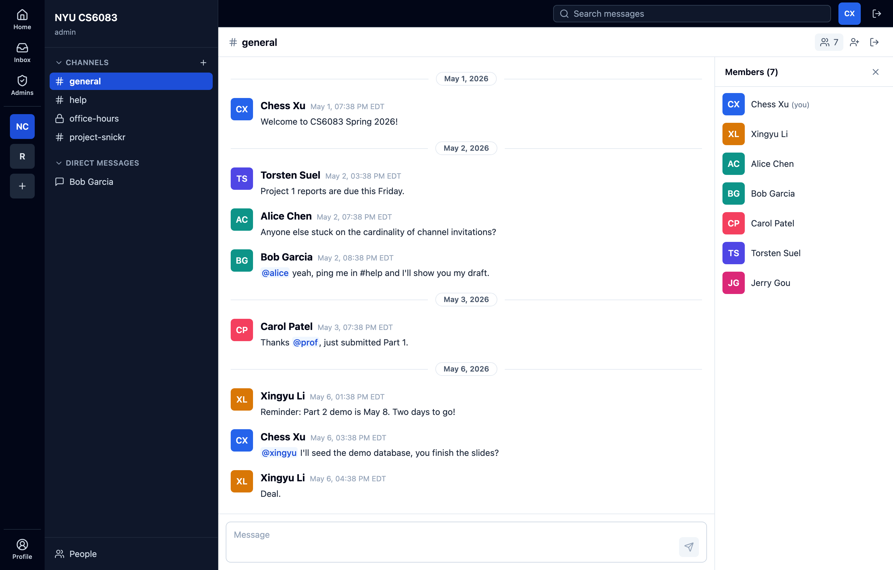
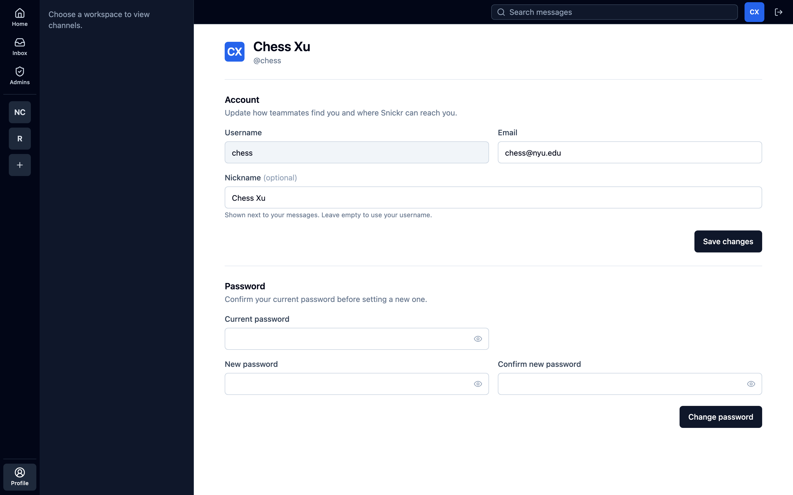

# Snickr — Design Report

Snickr is a three-tier web application. The presentation tier is a React
single-page app built with Vite. The application tier is a FastAPI service
that holds all business logic and is the sole originator of SQL. The data
tier is a local PostgreSQL instance, with a Supabase-hosted instance
available as a remote alternative. Browser-to-backend traffic is HTTP
carrying JSON. Backend-to-database traffic is SQL issued through asyncpg,
with two multi-step writes encapsulated as PL/pgSQL stored procedures.

---

## 2. Database Design

### 2.1 Requirements analysis and entity identification

The schema models a Slack-style collaboration product. A user account
represents a person who can sign in. A workspace is a top-level container
of users and channels, analogous to a Slack team. A channel is a stream
of messages inside a workspace, of one of three kinds: public, private,
or direct. Messages carry the textual content posted to a channel.
Membership tables record which users belong to which workspaces and
channels. Invitation tables record outstanding requests for a user to
join a workspace or a channel.

Six business rules drove the design:

- A workspace has at least one administrator at all times. The creator is
  seeded as the first administrator, and the system refuses any operation
  that would leave the workspace with zero admins.
- Channel visibility has three modes. A public channel can be self-joined
  by any workspace member. A private channel is invitation-only. A
  direct-message channel is created on demand between exactly two members
  of the same workspace and is reused on subsequent opens, preserving the
  timeline.
- Workspace membership is a prerequisite for any channel access in that
  workspace, and channel membership is a prerequisite for reading or
  posting messages in that channel. The two checks are independent, so
  revoking workspace membership reliably revokes all downstream access.
- Invitations follow a three-state lifecycle: pending, accepted, declined.
  A unique constraint on the invitee within a workspace collapses
  duplicate sends into a single row.
- The timeline is append-only at the row level. Edits update `content`
  and `edited_time` in place rather than creating a new row, and deletes
  are hard. Channel timeline reads are therefore a single monotonic scan
  ordered by `posted_time`, with no version chains or tombstones.
- Direct messages reuse the `channels` and `messages` tables rather than
  living in a parallel pair. The only differences from a regular channel
  are `channeltype` and a deterministic two-user channel name. Reuse
  collapses search, read, post, and timeline display into a single code
  path across all three channel kinds.

Project 2 introduced eight schema changes on top of the Project 1 DDL,
each shipped as a numbered migration so the original DDL stays intact and
reproducible.

- `001_widen_password.sql` widens `users.password` from `VARCHAR(30)` to
  `VARCHAR(255)`. The Project 1 column had been sized for plaintext
  before the hashing strategy was fixed. bcrypt hashes occupy 60
  characters, and the wider column accommodates future hash algorithms
  without an additional migration.
- `002_stored_procedures.sql` adds two stored procedures,
  `create_channel_for_member` and `accept_workspace_invitation`,
  documented in Section 2.4. Each wraps a multi-step transactional
  write inside the database, where atomicity is most important.
- `003_message_time_eastern.sql` redefines the default of
  `messages.posted_time` to `timezone('America/New_York', NOW())`. The
  rendered timestamps then match the wall-clock time at the demo
  location with no per-request timezone conversion in the application
  layer.
- `004_mentions.sql` adds a `mentions` table containing one row per
  `(messageID, mentioned_user)` pair. The application populates it on
  message creation by parsing `@username` patterns from the content and
  joining against `channelmember`. Both foreign keys cascade on delete,
  so removing a message or a user automatically cleans up mention rows.
- `005_message_edit.sql` adds an `edited_time` column to `messages`. The
  column is `NULL` for messages that have never been edited and is set
  to the wall-clock time on every edit, allowing the UI to render an
  `edited` marker without a separate audit table.
- `006_message_system_kind.sql` adds a `system_kind` column to
  `messages`. A `NULL` value marks an ordinary user message; a non-`NULL`
  value names the system event that produced the row, currently only
  `'join'`. Channel joins write a system message identifying who joined,
  and the edit and delete endpoints reject any message whose
  `system_kind` is non-`NULL`. The Inbox classifier in Section 3.1 also
  reads this column rather than matching on message content.
- `007_channelmember_hidden_at.sql` adds a `hidden_at` column to
  `channelmember`. A `NULL` value means the membership is visible in the
  user's channel list. A non-`NULL` timestamp means the user has
  dismissed a direct-message channel from their list. The membership
  row is retained so message history stays accessible and the partner
  is unaffected. Reopening the DM, or the partner posting a new message,
  clears the timestamp and the channel reappears.
- `008_message_thread.sql` adds an optional `parent_messageID` column
  to `messages` and a partial index on it. A `NULL` parent marks a
  top-level post; a non-`NULL` parent makes the row a thread reply.
  The application enforces that a reply lives in the same channel as
  its parent, since a Postgres `CHECK` constraint cannot reach across
  rows. Deleting a parent cascades through to its replies, so threads
  never outlive the message that started them.

Migrations are applied in numeric order. Each one is idempotent, and the
seed data in `database/seeds/sample_data.sql` assumes all eight have
already been applied.

### 2.2 Entity-relationship model



The diagram covers nine business tables: `users`, `workspaces`,
`workspacemember`, `workspaceinvitation`, `channels`, `channelmember`,
`channelinvitation`, `messages`, and `mentions`. The cardinalities are
shown on the connectors, and the foreign-key columns that realise each
relationship are listed in the constraint column of the per-table
schema in Section 2.3.

Three lookup tables, `roles`, `status`, and `channeltype`, sit alongside
the business tables and replace string enums. A workspace member holds a
foreign key into `roles` rather than a `VARCHAR` literal, an invitation
row holds a foreign key into `status`, and a channel holds a foreign key
into `channeltype`. New roles, statuses, or channel types can therefore
be added with a single insert into the lookup table rather than a
schema-altering data migration.

Participation constraints are weak by design, so the schema can describe
in-progress states. A user may belong to zero workspaces, a workspace may
contain zero channels for the brief moment between creation steps before
the default `general` channel is added, and a channel may be empty for the
moment between creation and the first message. The application
transactions described in Section 3.3 ensure that these gaps never become
visible to other users.

Notable design choices:

- Direct-message channels reuse the channel table with
  `channeltype.name = 'direct'` and a deterministic name derived from the
  two participants' user identifiers. Reopening a direct-message
  conversation returns the same channel identifier, so the URL is stable
  and the timeline is preserved.
- Thread replies are modelled with a self-referencing
  `messages.parent_messageID` foreign key rather than a separate
  `replies` table. A `NULL` parent marks a top-level post; a non-`NULL`
  parent links a reply to its thread. The same `messages` row therefore
  serves both timeline and thread, and the existing edit, delete,
  search, and mention paths apply unchanged.
- Workspace and channel deletes cascade. Removing a workspace removes
  its channels, members, and invitations. Removing a channel removes its
  messages and members. The `created_by` column on `workspaces` uses
  `SET NULL` rather than `CASCADE`, so a deleted user does not silently
  take a workspace down.

### 2.3 Relational schema

The schema consists of twelve tables. All identifiers are lowercase,
relying on Postgres folding for unquoted names. The full DDL is in
`database/schema/schema.sql`, with the incremental migrations enumerated
in Section 2.1. The full attribute list of each table follows.

#### `users`

| Column | Type | Constraints |
|---|---|---|
| **`userID`** | INTEGER | PK, identity |
| `email` | VARCHAR(50) | UNIQUE, NOT NULL |
| `username` | VARCHAR(30) | UNIQUE, NOT NULL |
| `nickname` | VARCHAR(30) | — |
| `password` | VARCHAR(255) | nullable, holds the bcrypt hash |
| `created_time` | TIMESTAMP | NOT NULL, default NOW() |
| `updated_time` | TIMESTAMP | NOT NULL, default NOW() |

The `password` column was widened from `VARCHAR(30)` to `VARCHAR(255)` by
migration `001` so it can hold a bcrypt hash and accommodate future hash
algorithms.

#### `workspaces`

| Column | Type | Constraints |
|---|---|---|
| **`workspaceID`** | INTEGER | PK, identity |
| `name` | VARCHAR(30) | NOT NULL |
| `description` | VARCHAR(200) | — |
| `created_time` | TIMESTAMP | NOT NULL, default NOW() |
| `updated_time` | TIMESTAMP | NOT NULL, default NOW() |
| `created_by` | INTEGER | nullable, FK → `users.userID` ON DELETE SET NULL |

`created_by` is nullable so that deleting a user does not cascade-delete
the workspaces they founded.

#### `roles`

| Column | Type | Constraints |
|---|---|---|
| **`roleID`** | INTEGER | PK, identity |
| `name` | VARCHAR(20) | UNIQUE, NOT NULL |

Seeded values: `'admin'`, `'member'`.

#### `workspacemember`

| Column | Type | Constraints |
|---|---|---|
| **`workspaceID`** | INTEGER | PK (composite), FK → `workspaces.workspaceID` ON DELETE CASCADE |
| **`userID`** | INTEGER | PK (composite), FK → `users.userID` ON DELETE CASCADE |
| `role` | INTEGER | NOT NULL, FK → `roles.roleID` |
| `joined_time` | TIMESTAMP | NOT NULL, default NOW() |

The composite PK `(workspaceID, userID)` enforces that a user appears at
most once in a given workspace.

#### `status`

| Column | Type | Constraints |
|---|---|---|
| **`statusID`** | INTEGER | PK, identity |
| `type` | VARCHAR(30) | UNIQUE, NOT NULL |

Seeded values: `'pending'`, `'accepted'`, `'declined'`. Shared by both
`workspaceinvitation` and `channelinvitation`, so the invitation lifecycle
is defined in one place.

#### `workspaceinvitation`

| Column | Type | Constraints |
|---|---|---|
| **`invitationID`** | INTEGER | PK, identity |
| `workspaceID` | INTEGER | NOT NULL, FK → `workspaces.workspaceID` ON DELETE CASCADE |
| `invitee` | INTEGER | NOT NULL, FK → `users.userID` ON DELETE CASCADE |
| `inviter` | INTEGER | NOT NULL, FK → `users.userID` |
| `invited_time` | TIMESTAMP | NOT NULL, default NOW() |
| `status_type` | INTEGER | NOT NULL, FK → `status.statusID` |

Unique constraint on `(workspaceID, invitee)` prevents duplicate invites
to the same user.

#### `channeltype`

| Column | Type | Constraints |
|---|---|---|
| **`typeID`** | INTEGER | PK, identity |
| `name` | VARCHAR(30) | UNIQUE, NOT NULL |

Seeded values: `'public'`, `'private'`, `'direct'`.

#### `channels`

| Column | Type | Constraints |
|---|---|---|
| **`channelID`** | INTEGER | PK, identity |
| `workspaceID` | INTEGER | NOT NULL, FK → `workspaces.workspaceID` ON DELETE CASCADE |
| `channel_name` | VARCHAR(50) | NOT NULL |
| `typeID` | INTEGER | NOT NULL, FK → `channeltype.typeID` |
| `created_by` | INTEGER | NOT NULL, FK → `users.userID` |
| `created_time` | TIMESTAMP | NOT NULL, default NOW() |
| `updated_time` | TIMESTAMP | NOT NULL, default NOW() |

Unique constraint on `(workspaceID, channel_name)` enforces that channel
names are unique within a workspace while allowing the same name to
exist in different workspaces.

#### `channelmember`

| Column | Type | Constraints |
|---|---|---|
| **`channelID`** | INTEGER | PK (composite), FK → `channels.channelID` ON DELETE CASCADE |
| **`userID`** | INTEGER | PK (composite), FK → `users.userID` ON DELETE CASCADE |
| `joined_time` | TIMESTAMP | NOT NULL, default NOW() |
| `hidden_at` | TIMESTAMP | nullable; non-`NULL` hides a DM channel from the user's list |

The composite PK prevents duplicate memberships. `hidden_at` was added by
migration `007` to support DM dismissal without deleting the membership
row, so the message history remains accessible to both participants.

#### `channelinvitation`

| Column | Type | Constraints |
|---|---|---|
| **`invitationID`** | INTEGER | PK, identity |
| `channelID` | INTEGER | NOT NULL, FK → `channels.channelID` ON DELETE CASCADE |
| `invitee` | INTEGER | NOT NULL, FK → `users.userID` ON DELETE CASCADE |
| `inviter` | INTEGER | NOT NULL, FK → `users.userID` |
| `invited_time` | TIMESTAMP | NOT NULL, default NOW() |
| `status_type` | INTEGER | NOT NULL, FK → `status.statusID` |

Unique constraint on `(channelID, invitee)` mirrors the workspace
invitation constraint.

#### `messages`

| Column | Type | Constraints |
|---|---|---|
| **`messageID`** | INTEGER | PK, identity |
| `channelID` | INTEGER | NOT NULL, FK → `channels.channelID` ON DELETE CASCADE |
| `content` | VARCHAR(500) | NOT NULL |
| `posted_time` | TIMESTAMP | NOT NULL, default `timezone('America/New_York', NOW())` |
| `edited_time` | TIMESTAMP | nullable, set on every edit |
| `posted_by` | INTEGER | NOT NULL, FK → `users.userID` |
| `system_kind` | VARCHAR(20) | nullable; non-`NULL` marks a system event such as `'join'` |
| `parent_messageID` | INTEGER | nullable, FK → `messages.messageID` ON DELETE CASCADE |

`edited_time` and `system_kind` were added by migrations `005` and `006`.
A non-`NULL` `system_kind` makes the row tamper-proof: the edit and
delete endpoints reject any message whose `system_kind` is set.

`parent_messageID` was added by migration `008` to support thread
replies. A `NULL` value marks a top-level post in the channel timeline;
a non-`NULL` value links a reply to its parent. The application enforces
that the parent lives in the same channel; Postgres `CHECK` constraints
cannot reference other rows. Deleting a parent removes its whole thread
through the `ON DELETE CASCADE` clause, so reply rows never outlive
their parent.

#### `mentions`

| Column | Type | Constraints |
|---|---|---|
| **`mentionID`** | INTEGER | PK, identity |
| `messageID` | INTEGER | NOT NULL, FK → `messages.messageID` ON DELETE CASCADE |
| `mentioned_user` | INTEGER | NOT NULL, FK → `users.userID` ON DELETE CASCADE |
| `created_time` | TIMESTAMP | NOT NULL, default `timezone('America/New_York', NOW())` |

Unique constraint on `(messageID, mentioned_user)` prevents the same
mention from being double-counted.

**Normalisation.** Every table is in third normal form. Each non-key
attribute depends on the whole primary key and on no other non-key
attribute. The user record carries no derived values. Membership tables
hold only the join key, the role or join time, and no facts about the
user or the channel. The lookup tables hold only the surrogate identifier
and the canonical name. Messages hold the channel pointer, the poster
pointer, the content, and the timestamps; the poster's name is not
denormalised onto the message and is joined at read time.

The lookup tables are the closest the design comes to denormalisation. A
`CHECK` constraint with an enumerated list would suffice and would avoid a
join. The schema uses tables instead so new values can be added with a
single `INSERT` rather than a schema migration, and so foreign-key
referential integrity catches typos that a `CHECK` list cannot.

**Indexes.** The schema declares five secondary indexes on top of the
implicit primary-key and unique-constraint indexes. Three are in
`schema.sql`, one is added by `004_mentions.sql`, and one by
`008_message_thread.sql`.

| Index | Table and columns | Reason |
| --- | --- | --- |
| `idx_messages_channel` | `messages (channelID)` | Channel timeline reads filter by `channelID` and order by `posted_time`. This is the most common read path in the system. |
| `idx_workspace_member_user` | `workspacemember (userID)` | The "list workspaces I belong to" query filters by `userID`. The composite primary key `(workspaceID, userID)` does not help this query because `workspaceID` is the leading column. |
| `idx_channel_member_user` | `channelmember (userID)` | Same reasoning as the workspace index, applied to channels. |
| `idx_mentions_user` | `mentions (mentioned_user, created_time DESC)` | The Inbox query filters by `mentioned_user` and orders by recency, so a covering composite index turns the read into a single backward index scan. |
| `idx_messages_parent` | `messages (parent_messageID) WHERE parent_messageID IS NOT NULL` | The thread-replies query filters by `parent_messageID`. A partial index excludes the top-level rows, which dominate the table, so the index is small and the lookup is a single seek. |

Foreign-key columns that participate in joins benefit from indexing
because of cascade-delete behaviour on the parent. Postgres scans the
child by the foreign key when the parent is deleted, and an index makes
that scan an index seek rather than a sequential scan.

### 2.4 Stored procedures and queries

The catalog below groups every database-encapsulated operation by
feature. Each entry names the responsible procedure or handler,
summarises its behaviour, and states its return shape. Two of the
operations, marked **stored procedure**, are PL/pgSQL functions in
`database/migrations/002_stored_procedures.sql`. The remaining
operations are FastAPI handlers under `backend/app/api/v1/`, marked
**handler transaction** when they open an explicit
`async with conn.transaction()` block and **parameterised SQL** when
they are a single statement. All three forms share the SQL injection
guarantee of Section 3.2: every value is bound through asyncpg's
`$1, $2, ...` placeholders.

**Authentication.**

- `register_user`. Parameterised SQL in `auth.py`. Bcrypt-hashes the
  password, inserts the `users` row, writes the user id to the session.
  409 on duplicate email or username.
- `authenticate_user`. Parameterised SQL in `auth.py`. Calls
  `bcrypt.checkpw` against the stored hash. 401 with a generic message
  on either an unknown username or a bad password so usernames cannot
  be enumerated.

**Workspace management.**

- `create_workspace`. Handler transaction in `workspaces.py`. Inserts
  the workspace row, the creator's admin membership, then calls
  `create_channel_for_member` to seed `#general`. All in one
  transaction.
- `create_channel_for_member`. **Stored procedure** with signature
  `(p_workspace_id, p_channel_name, p_type_name, p_user_id) RETURNS INTEGER`.
  Verifies workspace membership, resolves the channel type, inserts the
  `channels` row and the creator's `channelmember` row in one PL/pgSQL
  block.
- `invite_member`. Parameterised SQL in `workspaces.py`. Admin-only;
  inserts a pending row into `workspaceinvitation`. 409 on duplicate.
- `accept_workspace_invitation`. **Stored procedure** with signature
  `(p_invitation_id, p_user_id) RETURNS INTEGER`. Reads the invitation
  joined with `status`, validates it is addressed to the caller and
  still pending, updates the status, and inserts membership with
  `ON CONFLICT DO NOTHING` so concurrent accepts cannot double-insert.
- `respond_to_invitation`, decline path. Handler transaction in
  `workspaces.py`. Updates the invitation to `declined` under MVCC.
- `remove_member`. Handler transaction in `workspaces.py`. Inside one
  transaction, runs the locked last-admin guard if the target is an
  admin, then deletes the user's rows from `channelmember` for every
  channel in the workspace, then deletes the `workspacemember` row.
  Returns 204. See Section 3.3 for the locking shape.
- `change_member_role`. Handler transaction in `workspaces.py`. Promotes
  or demotes a member. The last-admin guard counts admins under a row
  lock and refuses any change that would leave the workspace with zero
  admins; see Section 3.3 for the locking shape.

**Channel management.**

- `create_channel` is `create_channel_for_member`, described above.
- `join_channel`. Parameterised SQL in `channels.py`. Workspace
  membership and `channeltype = 'public'` required. Insert is
  `ON CONFLICT DO NOTHING`.
- `invite_to_channel`. Parameterised SQL in `channels.py`. Channel
  member only; inserts a pending row into `channelinvitation`. 409 on
  duplicate.
- `respond_to_channel_invitation`. Handler transaction in `channels.py`.
  On accept, the invitation status update and the `channelmember`
  insert commit together. On decline, only the invitation is updated.
- `open_direct_message`. Handler transaction in `channels.py`. Upserts
  a channel keyed by the deterministic name `dm-{minId}-{maxId}` and
  inserts both participants. Reopening always returns the same
  `channelID`.

**Messaging.**

- `post_message`. Parameterised SQL in `messages.py`. Inserts into
  `messages` after asserting channel membership. If a `parentMessageId`
  is present, the handler verifies the parent is in the same channel,
  is not a system message, and is itself top-level (Section 7.12).
- `list_thread_replies`. Parameterised SQL in `messages.py`. Returns
  every message whose `parent_messageID` matches a given parent.
- `get_channel_messages`. Parameterised SQL in `messages.py`. Returns
  the channel timeline ordered by `posted_time` then `messageID`. The
  `idx_messages_channel` index covers the filter.
- `get_user_messages`. Parameterised SQL in `messages.py`. Lists every
  message posted by a given user, scoped to channels the caller can see.

**Search.**

- `search_messages`. Parameterised SQL in `messages.py`. Substring
  search joined through `channelmember` so the result set is intersected
  with the caller's visible channels. The wildcards live in the bound
  value `f"%{q}%"`, not in the SQL text, so a user query of `100%`
  searches for the literal string `100%`.
- `search_channels` is not exposed as its own endpoint. The frontend's
  channel sidebar already shows every channel the user can see, so a
  channel search would duplicate the existing list endpoint.

**Why two stored procedures and not twelve.** Stored procedures were
reserved for the two operations where atomicity across multiple tables
matters most and the application would otherwise have to coordinate the
sequence by hand: channel creation with the first-member insert, and
invitation acceptance with the membership insert. Both are pure data
operations that need no Python logic between the steps, so pushing the
sequence into PL/pgSQL trades nothing and gains a single network
round-trip. Other multi-step writes, for example posting a message and
inserting its mention rows, also need to run as one unit, but the
surrounding handler still has to map errors to HTTP status codes,
emit log events, and serialise a Pydantic response. Those paths use
`async with conn.transaction()` in Python, where the transaction
coexists naturally with the framework code. Single-table reads and
writes do not benefit from either form of encapsulation and stay in
the handlers as parameterised SQL.

The seven Part 1 query templates, kept as parameterised statements with
`:name` placeholders in `database/queries/queries.sql`, are reissued by
the Part 2 backend as parameterised asyncpg calls. The same logic is
therefore reachable both from the Postgres CLI and from the JSON API.

---

## 3. Backend Design

### 3.1 API layer structure

The backend is written in Python 3.11 on FastAPI, with asyncpg as the
Postgres driver, bcrypt for password hashing, Pydantic v2 for request
and response validation, and Starlette's `SessionMiddleware` for signed
cookie sessions. FastAPI was chosen for two reasons. First, it generates
an interactive API explorer at `/docs` from the same Pydantic models
that validate requests, eliminating drift between the implementation and
the documented contract. Second, its dependency-injection mechanism
makes authentication checks visible in every route signature.

Two middlewares run before the router: `CORSMiddleware` for the
`FRONTEND_ORIGIN` allow-list, and `SessionMiddleware` for the signed
`snickr_session` cookie. Routers live under `app/api/v1/`, one per
resource group: `auth.py`, `workspaces.py`, `channels.py`, `messages.py`,
and `mentions.py`, plus a small `deps.py` for shared dependencies.

Each handler depends on `get_conn`, which leases an `asyncpg.Connection`
from a pool created during the FastAPI lifespan. One connection per
request means every query inside a handler runs on the same connection
and the same transaction context.

**Endpoint inventory.** The API is organised into five resource groups
under `/api`: authentication, workspaces, channels, messages, and the
inbox plus search. FastAPI's `/docs` is the canonical reference for
path, method, request body, and response schema.

**Path conventions.** Resource paths are pluralised, identifiers are
numeric, and nested paths mirror containment: a channel lives under a
workspace, its messages live under the channel. `PUT` is not used
because no resource carries a fully replaceable representation; partial
edits go through `PATCH` and bespoke actions such as accepting an
invitation or joining a channel are `POST`.

**Request and response format.** Every request and response body is
JSON encoded as UTF-8. Field names are camelCase on the wire, while
Postgres identifiers are lowercase. The mapping is performed in SQL with
column aliases such as `SELECT workspaceID AS "workspaceId"`. Aliasing
in SQL rather than in a global serialiser keeps the SQL readable and
makes the mapping inspectable in the source.

**Error handling.** Error responses are FastAPI's default JSON shape
with a single `detail` field. Two project-specific decisions are worth
calling out. Private and direct channels return 404 to non-members
rather than 403, so the existence of a private channel is hidden from
users who are not invited. Lifecycle conflicts such as accepting an
already-accepted invitation or hitting a unique constraint return 409
rather than 400, so the frontend can distinguish "your input was
malformed" from "the server state already disagrees with your action".

**Membership exit.** `POST /api/channels/{id}/leave` deletes the
caller's `channelmember` row for a public or private channel. For a
direct-message channel the same endpoint sets `hidden_at` instead, so
the timeline survives for both participants (Section 7.8).
`DELETE /api/workspaces/{id}` disbands an entire workspace through the
foreign-key cascade on `workspaces` and is the supported way to retire
a workspace whose last admin also wants to leave.

**Inbox event log.** The `mentions` table stores three kinds of Inbox
events under the same row format. A regular `@username` mention writes
one row for the mentioned user. A direct-message post writes one row for
the other participant in the channel, so DMs surface in the Inbox without
a separate notifications table. A successful self-join into a public
channel writes a system message with `system_kind = 'join'` and a
mention row addressed to the channel creator, so the owner of the
channel sees who joined. The `GET /api/me/mentions` query classifies
each row at read time using a `CASE` expression: `'dm'` when the channel
type is `direct`, `'join'` when the underlying message has
`system_kind = 'join'`, otherwise `'mention'`. The classifier reads from
columns rather than matching on message content, so a user who happens
to type `joined the channel` is not misclassified as a system join
event.

### 3.2 Security: guarding against SQL injection

Every query and every stored-procedure invocation passes user input
through asyncpg's parameter binding. The Postgres extended-query
protocol prepares each statement once and binds its arguments through
the binary protocol, so input that resembles SQL keywords cannot escape
its placeholder. There is no codepath in the application where user
text is concatenated into a SQL string, no f-string interpolation of
user input, and no manual escaping. The course specification calls out
stored procedures and prepared statements as acceptable mitigations,
and the design relies on both.

**Stored procedures as an additional layer.** The two procedures from
Section 2.4 take typed arguments and are invoked through
`SELECT create_channel_for_member($1, $2, $3, $4)` style calls. The
application layer therefore never constructs raw SQL even for the most
sensitive multi-step writes. The procedure body is owned by the database
schema rather than by the application, so a future application bug
cannot cause a malformed write inside the procedure.

**Input validation layer.** Pydantic v2 models in `app/schemas/` describe
both request payloads and response shapes. Field length limits in these
models mirror the schema constraints, so a 31-character username is
rejected at validation time before it reaches Postgres. Email addresses
are validated against the RFC 5321 mailbox grammar by Pydantic's
`EmailStr`. Type coercion is strict, so passing the string `"1"` where
an integer is required is rejected rather than silently parsed.

**Vulnerable versus safe pattern.** A vulnerable Python pattern would
build SQL with f-strings such as
`f"INSERT INTO messages (content) VALUES ('{user_text}')"`, where a
message containing `'); DROP TABLE messages; --` would parse as two SQL
statements and the second one would drop the table. The Snickr backend
never builds SQL this way. Every write looks like
`await conn.execute("INSERT INTO messages (content) VALUES ($1)", user_text)`,
where asyncpg sends the SQL and the bound argument as separate fields in
the Postgres extended-query protocol. The user text is always a value
and never grammar.

**Mention parsing follows the same rule.** A regex extracts candidate
handles from the message text in Python, then the list is passed to
Postgres as a bound `text[]` argument with
`username = ANY($1::text[])`. The lookup never builds a `WHERE` clause
out of user-supplied substrings, so the same structural guarantee
applies.

### 3.3 Concurrency control and transactions

Multiple users use the system simultaneously, so any operation that
touches more than one row must be safe under concurrent execution. The
backend addresses this in two ways: multi-statement writes run inside
Postgres transactions so each commits as a unit or rolls back as a unit,
and everything else is left to Postgres's default MVCC isolation.

**Transactional operations.** Every place the backend opens an explicit
transaction, with the invariant it preserves.

- Workspace creation. Workspace row + admin membership + default
  `general` channel via `create_channel_for_member`. Invariant: no
  workspace exists without an admin or without `general`.
- Direct-message channel creation. Channel upsert + both
  `channelmember` rows. Invariant: either both participants see the DM
  or neither does.
- Member removal. Channel memberships first, then the workspace
  membership. Invariant: no channel rows outlive the workspace
  membership.
- Channel-invitation response. Status update plus, on accept, the
  membership insert. Invariant: an invitation is never marked accepted
  without its membership row.
- Workspace-invitation decline. Status read + update under MVCC.
  Invariant: concurrent accept and decline cannot both succeed.
- Workspace-invitation acceptance. Encapsulated inside the
  `accept_workspace_invitation` stored procedure (Section 2.4).
  Invariant: two users racing to accept the same invitation cannot both
  succeed.
- Message creation. Inserts the message and its mention rows together.
  Invariant: a message and its mentions commit as a unit.
- Message editing. Content + `edited_time` update, plus delete-and-
  reinsert of the mention rows. Invariant: edited content and the
  mention set are never out of sync.

**Isolation level.** The default Postgres isolation level, READ
COMMITTED, is left in place. The backend's writes touch a small number
of unrelated rows across tables, and the unique constraints below catch
the few cases where two writers could land on the same key. The
application does not rely on any stricter isolation level.

**Unique constraints as a safety net.** Where two writers could race to
insert duplicates, the schema's unique constraints act as the final
safety net.

- `(workspaceID, channel_name)` on `channels` guarantees that two
  simultaneous create-channel calls cannot both succeed, even if both
  pass the duplicate-name check before either writes.
- `(workspaceID, invitee)` on `workspaceinvitation` plays the same role
  for workspace invitations and is the reason duplicate invites collapse
  into a 409 rather than a phantom second row.
- `(channelID, invitee)` on `channelinvitation` plays the same role for
  channel invitations.
- `(workspaceID, userID)` on `workspacemember` and
  `(channelID, userID)` on `channelmember` prevent the same user from
  being inserted twice if two accept calls land at the same instant.
  The stored-procedure path uses `ON CONFLICT DO NOTHING` so the second
  insert is silently absorbed rather than raising.

**Last-admin guard.** A workspace must have at least one administrator
at all times. The backend enforces this in `remove_member` and
`change_member_role`. Both handlers open a transaction, run a locked
admin count, and then perform the delete or role update inside the
same transaction. The lock is expressed as a CTE that selects the
admin `workspacemember` rows `FOR UPDATE OF wm` and feeds the locked
rows into a `COUNT(*)`. Postgres does not allow `FOR UPDATE` directly
beside an aggregate, hence the CTE shape. Two admins demoting each
other concurrently now serialise: the second transaction blocks on the
first row lock, and when it resumes the count reads one and the
operation is rejected with 409, preserving the invariant of at least
one admin per workspace.

### 3.4 Session state and URL design

The backend keeps session state in a signed cookie and uses URLs only
to address content. Identity travels in the cookie, never in the URL.

**Session mechanism.** Sessions are implemented with Starlette's
`SessionMiddleware`, which signs a JSON document with the secret key in
`SESSION_SECRET` and stores the result in a cookie named
`snickr_session`. Three alternatives were evaluated. A JWT bearer token
would require the frontend to attach the token explicitly on every
request, adding client-side code without removing trust in the browser.
A server-side session store would require a second backing service such
as Redis, which the deployment scope does not justify. A signed cookie
fits the project's needs because the cookie is HTTP-native, browsers
attach it automatically on same-origin requests, and the signature
prevents offline tampering. The cookie is signed rather than encrypted,
so a user could in principle inspect the contents, which is acceptable
for a numeric user identifier.

**Cookie attributes.** The cookie is marked `httpOnly`, so client-side
JavaScript cannot read it; a hypothetical XSS payload therefore cannot
exfiltrate the session through `document.cookie`. It is marked
`sameSite=lax`, so the browser does not attach it to cross-site `POST`
requests, which mitigates CSRF on state-changing endpoints. Its lifetime
is seven days, after which the browser drops the cookie and the next
protected request returns 401.

**URL design philosophy.** URLs are RESTful, bookmarkable, and
human-readable. The frontend mirrors the API path structure, so a URL
encodes a position in the data rather than a position in the UI. A
workspace lives at `/api/workspaces/{id}` and at `/app/workspaces/{id}`.
A channel lives at `/api/channels/{id}` and at
`/app/workspaces/{id}/channels/{id}`. A search result page lives at
`/app/search?q={query}`. None of these URLs encodes the user's identity,
so the same URL points at the same conceptual resource for every user,
and the backend decides at request time whether the caller is allowed
to see it. The user's profile page lives at `/app/profile`, deliberately
unparameterised by user identifier; the page reads its content from
`/api/auth/me`, and the backend resolves "me" from the session.

**Deep linking.** The frontend reconstructs page state from the URL on
every load. A pasted channel or search URL survives the login round
trip: the protected route stashes the original `Location` in React
Router's `state` and the login page reads `location.state.from.pathname`
after a successful sign-in to navigate back. The URL itself stays
clean.

**Session invalidation.** `POST /api/auth/logout` clears the
server-side session dictionary so the next request from that browser
fails authentication. There is no refresh-token mechanism: an expired
seven-day cookie sends the user back through login. Cookie expiry and
explicit logout are the two paths to session invalidation.

### 3.5 Cross-site scripting (XSS)

XSS defence is split between the backend and the React frontend. The
rendering boundary is the load-bearing element of the defence.

The backend stores user-submitted text exactly as received. It does
not call `htmlspecialchars`, strip HTML tags, or normalise whitespace
at write time. A message whose content is `<script>alert(1)</script>`
is stored as those 26 literal characters.

Escaping at write time would couple the database representation to a
single output format. A future plain-text export, a mobile client, or
a CLI viewer would have to undo HTML escaping before re-escaping for
its own output context. Storing the original input keeps the data
clean and pushes escaping to the rendering boundary, where the output
context is actually known.

The rendering boundary is the React frontend. React's JSX expression
syntax `{value}` always produces a text node, never raw HTML, so an
injected `<script>` tag in a message body becomes the literal four
characters `<`, `s`, `c`, `r` rather than an executable script element.
The codebase does not use `dangerouslySetInnerHTML`, the only React API
that opts out of automatic escaping. Every place a message can appear
in the UI flows through the same `<MessageItem>` component, so a single
audit point covers every rendering path. A payload such as
`` typed into the composer is therefore
rendered as the literal characters of an HTML tag rather than as an
`img` element, so the `onerror` handler is never attached and never
fires.

Two backend choices reinforce the rendering-layer defence. The session
cookie is marked `httpOnly`, so a hypothetical script that did execute
in the page could not exfiltrate the cookie through `document.cookie`.
The cookie is also marked `sameSite=lax`, which prevents the browser
from attaching it to cross-site `POST` requests, blunting CSRF as a
secondary effect. Neither attribute is XSS protection on its own, but
each limits the damage of a hypothetical render-layer mistake.

---

## 7. Session Logs

`docs/session-logs/run_session.sh` drives an end-to-end multi-user
session against a freshly seeded database. The captured backend log
is at `docs/session-logs/session-2026-05-08.txt` and the Playwright
screenshots are in the same directory. The `### [HH:MM:SS]` headers
in the excerpts below come from the driver, not the backend.

### 7.1 Authentication and workspace navigation

Chess signs in and enters NYU CS6083.


```
### [18:36:07] chess logs in with the seeded password
2026-05-07 18:36:07 INFO  snickr.event auth.login uid=1 username=chess
2026-05-07 18:36:07 INFO  snickr.http  POST /api/auth/login 200 uid=1 286ms
### [18:36:08] chess fetches workspaces she belongs to
2026-05-07 18:36:08 INFO  snickr.http  GET  /api/workspaces 200 uid=1 4ms
### [18:36:08] chess lists CS6083 channels
2026-05-07 18:36:08 INFO  snickr.http  GET  /api/workspaces/1/channels 200 uid=1 10ms
### [18:36:09] chess reads #general timeline
2026-05-07 18:36:09 INFO  snickr.http  GET  /api/channels/1/messages 200 uid=1 3ms
```

### 7.2 Mentions and the Inbox

Chess posts an announcement that mentions Bob. Bob signs in from a
second browser, opens the Inbox, and sees the new entry under the
`mention` group.


```
### [18:36:09] chess posts an announcement that @mentions bob
2026-05-07 18:36:10 INFO  snickr.event message.post uid=1 channelId=1 messageId=38 mentions=1 length=57
2026-05-07 18:36:10 INFO  snickr.http  POST /api/channels/1/messages 201 uid=1 7ms
### [18:36:10] bob logs in from another browser
2026-05-07 18:36:10 INFO  snickr.event auth.login uid=4 username=bob
### [18:36:10] bob checks his Inbox - sees the new mention
2026-05-07 18:36:10 INFO  snickr.http  GET  /api/me/mentions 200 uid=4 10ms
```

The third Inbox classification, `join`, is exercised in Section 7.5
when Dave self-joins Chess's new public channel. Chess's Inbox after
that step contains all three event kinds.

### 7.3 Editing, deleting, and searching messages

Chess edits her own announcement inline. The edit re-parses mentions
from the new body so the Inbox stays in sync with the message text.



Chess then searches for `demo`. The query is intersected with
`channelmember`, so private-channel hits leak only to channel members.


```
### [18:36:11] chess edits her announcement (PATCH messages, sets edited_time)
2026-05-07 18:36:11 INFO  snickr.event message.edit uid=1 channelId=1 messageId=38 mentions=1
2026-05-07 18:36:11 INFO  snickr.http  PATCH /api/channels/1/messages/38 200 uid=1 10ms
### [18:36:11] chess posts a throwaway message and then deletes it
2026-05-07 18:36:12 INFO  snickr.event message.post uid=1 channelId=1 messageId=40 mentions=0 length=18
2026-05-07 18:36:12 INFO  snickr.event message.delete uid=1 channelId=1 messageId=40
### [18:36:12] bob tries to edit chess's message - 403 forbidden
2026-05-07 18:36:12 INFO  snickr.http  PATCH /api/channels/1/messages/38 403 uid=4 2ms
### [18:36:12] chess searches for 'demo' (4 hits across visible channels)
2026-05-07 18:36:12 INFO  snickr.event search uid=1 q=demo hits=4
```

### 7.4 Workspace invitation acceptance through a stored procedure

Dave logs in and accepts his pending invitation to NYU CS6083. The
accept path runs through the `accept_workspace_invitation` stored
procedure (Section 2.4), so the invitation status update and the
membership insert commit together.



```
### [18:36:13] dave logs in - he has a pending workspace invitation
2026-05-07 18:36:13 INFO  snickr.event auth.login uid=6 username=dave
### [18:36:13] dave lists pending workspace invitations
2026-05-07 18:36:13 INFO  snickr.http  GET  /api/me/workspace-invitations 200 uid=6 3ms
### [18:36:14] dave accepts the invitation - accept_workspace_invitation stored procedure runs
2026-05-07 18:36:14 INFO  snickr.event workspace.invitation_accept uid=6 invitationId=1 workspaceId=1
2026-05-07 18:36:14 INFO  snickr.http  POST /api/me/workspace-invitations/1 200 uid=6 7ms
```

### 7.5 Channel creation through a stored procedure and the `join` event

Chess creates a new public channel `#ship-it` through the
`create_channel_for_member` stored procedure (Section 2.4).


Dave self-joins `#ship-it`. The join writes a `system_kind='join'`
message and a mention to the creator, so Chess's Inbox now contains
all three event kinds: `mention`, `dm`, and `join`.

```
### [18:36:14] chess creates a new public channel #ship-it (calls create_channel_for_member SP)
2026-05-07 18:36:14 INFO  snickr.event channel.create uid=1 workspaceId=1 channelId=9 name=ship-it type=public
2026-05-07 18:36:14 INFO  snickr.http  POST /api/workspaces/1/channels 201 uid=1 4ms
### [18:36:14] dave self-joins #ship-it (writes system_kind='join' message + mention row to creator chess)
2026-05-07 18:36:14 INFO  snickr.event channel.join uid=6 channelId=9 new=True
### [18:36:15] chess fetches Inbox - now contains all three event kinds (mention, dm, join)
2026-05-07 18:36:15 INFO  snickr.http  GET  /api/me/mentions 200 uid=1 20ms
```

Mention autocomplete in the composer surfaces channel members whose
username or nickname starts with the substring after the most recent
`@`.


### 7.6 Channel invitation flow on a private channel

Chess creates a private channel `release-prep`. Alice cannot see it
in the channel list, and a direct `GET /api/channels/{id}` returns
404 rather than 403, so the channel's existence is hidden from
non-members. Chess invites Alice by username.



Alice accepts. The status update and membership insert commit together
inside one transaction.

```
### [18:36:15] chess creates a private channel #release-prep
2026-05-07 18:36:15 INFO  snickr.event channel.create uid=1 workspaceId=1 channelId=10 name=release-prep type=private
### [18:36:16] alice tries to fetch #release-prep before being invited - 404 hides existence
2026-05-07 18:36:16 INFO  snickr.http  GET  /api/channels/10 404 uid=3 2ms
### [18:36:16] chess invites alice to #release-prep
2026-05-07 18:36:16 INFO  snickr.event channel.invite uid=1 channelId=10 invitee=alice invitationId=2
### [18:36:16] alice accepts the channel invitation
2026-05-07 18:36:16 INFO  snickr.event channel.invitation_response uid=3 invitationId=2 channelId=10 status=accepted
```

### 7.7 Last-admin guard

Alice is the only administrator of the Roommates workspace. Demoting
herself fails with 409 (see Section 3.3 for the locking shape).



After promoting Bob to admin first, the same demotion succeeds.

```
### [18:36:17] alice (sole admin of Roommates) tries to demote herself - last-admin guard refuses with 409
2026-05-07 18:36:17 INFO  snickr.event workspace.last_admin_guard uid=3 workspaceId=2 target=3 action=demote
2026-05-07 18:36:17 INFO  snickr.http  PATCH /api/workspaces/2/members/3/role 409 uid=3 4ms
### [18:36:17] alice promotes bob to admin first
2026-05-07 18:36:17 INFO  snickr.event workspace.role_change uid=3 workspaceId=2 target=4 role=admin
### [18:36:18] alice now safely demotes herself
2026-05-07 18:36:18 INFO  snickr.event workspace.role_change uid=3 workspaceId=2 target=3 role=member
```

### 7.8 Direct messages and the soft-delete pattern

Bob opens a DM with Alice. The handler upserts a channel keyed by the
two user ids, so reopening always returns the same `channelId` and
preserves the timeline.



Bob then hides the DM from his sidebar. Leaving a DM sets
`channelmember.hidden_at` rather than deleting the row, so Alice's
view is unchanged and a new message from her clears the flag.

```
### [18:36:19] bob opens a DM with alice in CS6083
2026-05-07 18:36:19 INFO  snickr.event channel.dm_open uid=4 workspaceId=1 channelId=11 partner=alice
### [18:36:20] bob hides the DM from his sidebar (soft delete via hidden_at)
2026-05-07 18:36:20 INFO  snickr.event channel.dm_hide uid=4 channelId=8
2026-05-07 18:36:20 INFO  snickr.http  POST /api/channels/8/leave 204 uid=4 2ms
```

### 7.9 Security guards

Three adversarial inputs were submitted during the session: a SQL
injection payload as a registration nickname, a SQL injection payload
as a search query, and an XSS payload as a message body. Each was
stored verbatim and rendered as literal text. The defences are
described in Sections 3.3 and 3.5.

```
### [18:36:18] security: anonymous attacker registers with SQL-injection-shaped nickname (stored as literal text)
2026-05-07 18:36:18 INFO  snickr.event auth.register uid=9 username=eve
2026-05-07 18:36:18 INFO  snickr.http  POST /api/auth/register 201 uid=9 231ms
### [18:36:18] security: bob runs a SQL-injection-shaped search query (bound as literal substring, returns 0 hits)
2026-05-07 18:36:18 INFO  snickr.event search uid=4 q="'); DROP TABLE messages; --" hits=0
### [18:36:19] security: carol posts an XSS payload (stored verbatim, escaped at render)
2026-05-07 18:36:19 INFO  snickr.event message.post uid=5 channelId=1 messageId=43 mentions=0 length=53
```

### 7.10 Account management and read-only browsing

Chess updates her password. The handler requires the current password
to match before it accepts the new one, so the session cookie alone
is not enough to take over an account.



Chess logs out, signs in with the new password, then restores the
seed password.

Chess also browses three Part 1 admin views: the cross-workspace
admin list, the messages-by-user view for Bob, and the stale channel
invitations report. The stale-invites report uses a `LEFT JOIN` so
channels with zero stale invites still appear, matching the Part 1
c.7 specification.


```
### [18:36:20] chess changes her password via PATCH /api/auth/me
2026-05-07 18:36:20 INFO  snickr.http  PATCH /api/auth/me 200 uid=1 471ms
### [18:36:21] chess logs out, then logs back in with the new password
2026-05-07 18:36:21 INFO  snickr.event auth.logout uid=1
2026-05-07 18:36:21 INFO  snickr.event auth.login  uid=1 username=chess
### [18:36:21] chess restores the original password so the seed remains valid
2026-05-07 18:36:22 INFO  snickr.http  PATCH /api/auth/me 200 uid=1 448ms
```

### 7.11 Workspace lifecycle

Chess creates a throwaway `Sandbox` workspace and disbands it. The
DELETE relies on the foreign-key cascade on `workspaces`, so no
application-side cleanup is needed.

```
### [18:36:22] chess creates a throwaway workspace 'Sandbox' to demo disband
2026-05-07 18:36:22 INFO  snickr.event workspace.create uid=1 workspaceId=3 name=Sandbox
2026-05-07 18:36:22 INFO  snickr.http  POST /api/workspaces 201 uid=1 4ms
### [18:36:22] chess disbands Sandbox - foreign-key cascade removes channels, members, invites
2026-05-07 18:36:22 INFO  snickr.event workspace.disband uid=1 workspaceId=3
2026-05-07 18:36:22 INFO  snickr.http  DELETE /api/workspaces/3 204 uid=1 4ms
```

### 7.12 Thread replies

Chess starts a thread in `#ship-it` and Dave replies. The post handler
enforces four parent invariants: exists, same channel, not a system
message, and not itself a reply. The last keeps threads flat. Replies
are hidden from the main timeline; the parent's reply-count badge is
the only sign of a thread.


```
### [19:47:38] chess posts a question in #ship-it that becomes a thread parent
2026-05-07 19:47:38 INFO  snickr.event message.post uid=1 channelId=9 messageId=48 mentions=0 length=37
### [19:47:38] dave replies in the thread (parentMessageId set, parent same channel verified)
2026-05-07 19:47:38 INFO  snickr.event message.post uid=6 channelId=9 messageId=49 mentions=0 length=10
### [19:47:38] chess replies again in the same thread, replyCount on parent now reads 2
2026-05-07 19:47:39 INFO  snickr.event message.post uid=1 channelId=9 messageId=50 mentions=0 length=17
### [19:47:39] chess fetches the replies for the parent message
2026-05-07 19:47:39 INFO  snickr.http  GET  /api/channels/9/messages/48/replies 200 uid=1 9ms
### [19:47:39] dave attempts a cross-channel reply - 400 rejected
2026-05-07 19:47:39 INFO  snickr.http  POST /api/channels/9/messages 400 uid=6 2ms
```

The unabridged transcript of all twelve scenes is committed at
`docs/session-logs/session-2026-05-08.txt`.